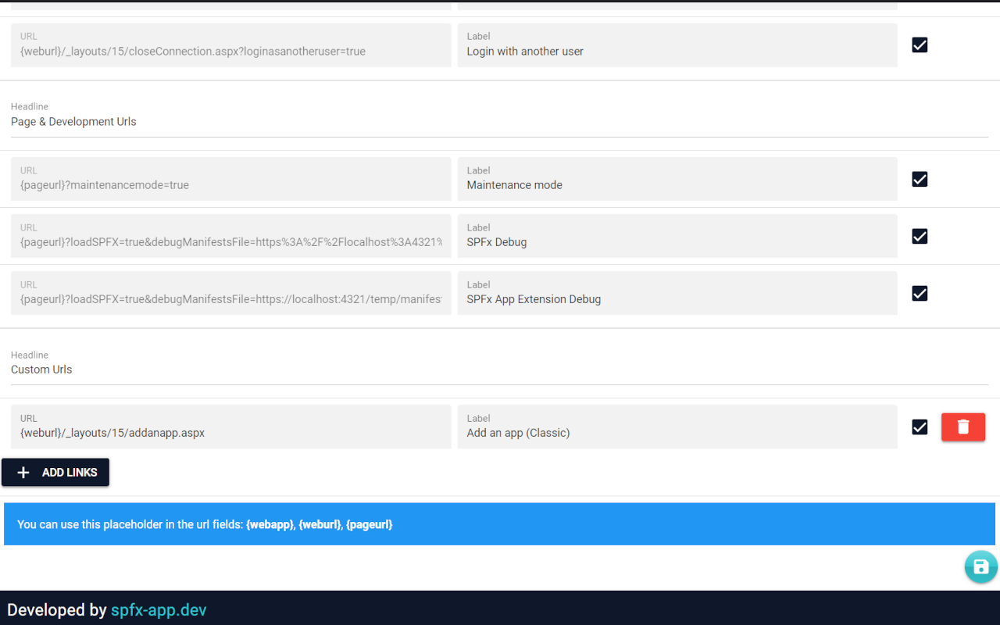

# SharePoint Quicklinks (Browser Extension)

This extension displays useful URLs on a SharePoint online site, which are applied to the currently visited site/page. Additionally, you can store your own URLs. This extension offers various quick links to SharePoint, such as site contents, site settings, site permissions, etc. This saves a lot of "clicks". 

For me as a SharePoint developer and all other SharePoint developers, some URLs are of course also very useful for SPFx development. Therefore, in addition to the "normal" `loadSPFx=true` URL parameters (with which you can test the SPFx WebParts on the current page), there is also the option of loading an SPFx Application Customizer. For this purpose, the App Id is requested (prompt dialog) as soon as you click on the URL.

You can use the placeholders `{webappurl}`, `{weburl}`, and `{pageurl}`. Only links that have been "enabled" by the user will be displayed. The placeholder `{pageurl}` is replaced by the current (SharePoint) page URL. If you are not on a page, the links are not displayed.

## Download

You can download it from the [Chrome web store](https://chrome.google.com/webstore/detail/sharepoint-quicklinks/ehmphjkdhndbdpfhhckemmhapfahlbhe) (for all Chromium based Browsers)

## Popup View

## Settings view

